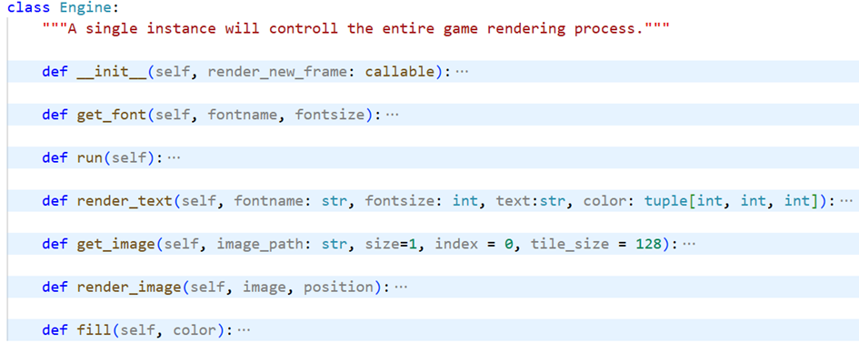

# KUL Game Jam 2025

Submission for KUL Game Jam 2025

## Develop

Install dependancies: ```pip install -r .\requirements.txt```

Then run the main file (from the root directory): ```python ./src/```

Engine:



<picture>
  <source media="(prefers-color-scheme: light)" srcset="docs/engine-props-light.png">
  <source media="(prefers-color-scheme: dark)" srcset="docs/engine-props-dark.png.">
</picture>

## Compile

```pyinstaller -y compile.spec; rm -r build/; copy .\resources\ .\dist\KULGameJam\```
